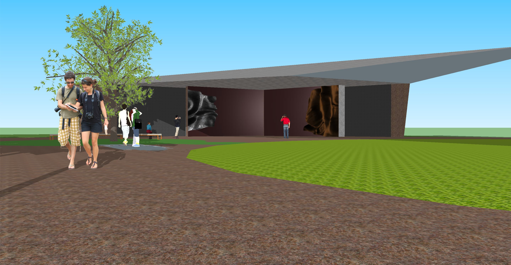
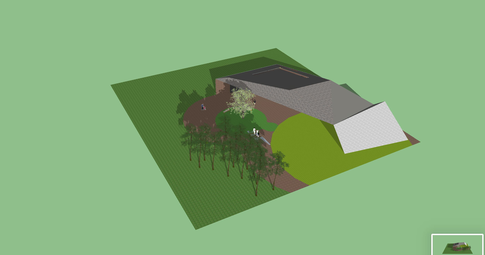
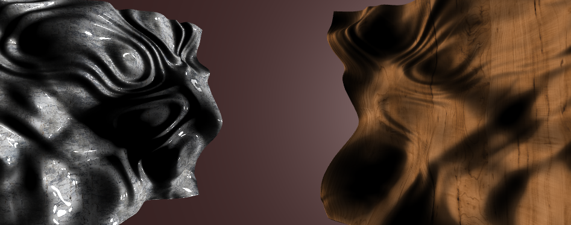

# Collisions

Collisions is a generative experience created in response to the
work of Barbara Hepworth. An outdoor exhibition that's influenced by the
movements of its visitors, as they move through the space the forms morph in
reply.

