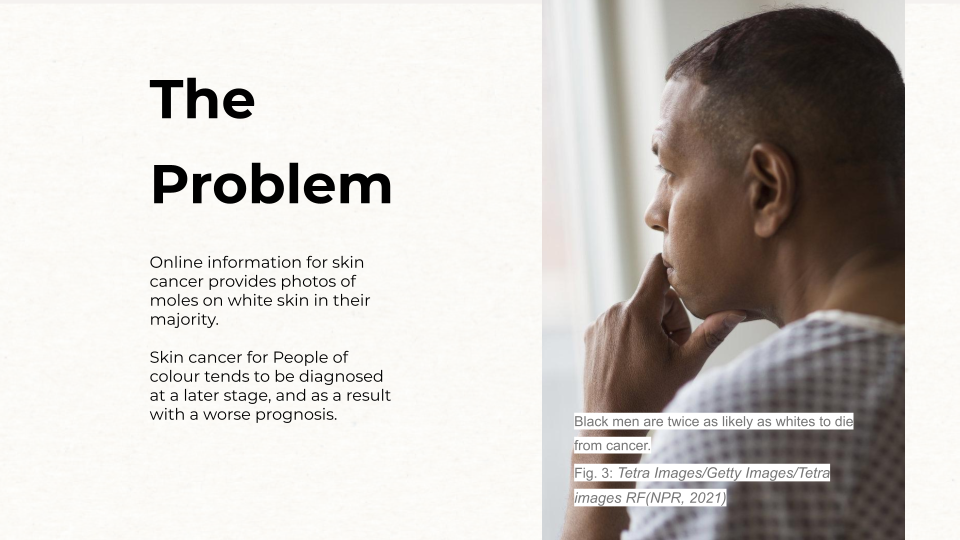

A health tool that helps in the detection of Melanoma cancer or dark and black skin
Meet Melanoma is an AI diagnostic system that keeps track of your full body skin and helps detect melanoma's skin cancer.
Meet Melanoma is a Technological medical app that uses Ai analytics tools to detect skin cancer on dark and black skin.
With Meet Melanoma You can keep track of your marks and moles monthly.

